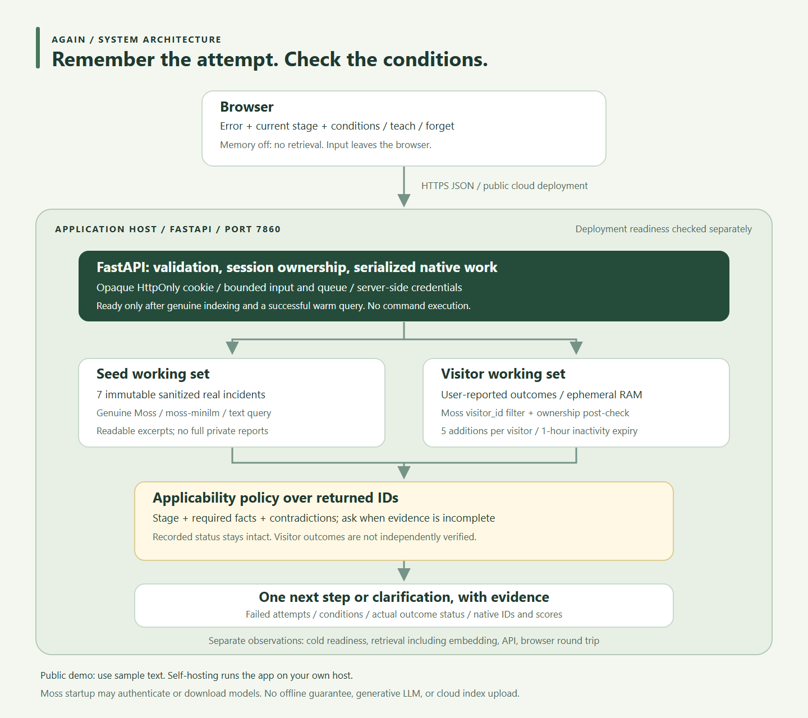

# Again architecture

Again combines genuine text retrieval with an explicit evidence-applicability policy. There is no generative LLM or command executor. The application host runs FastAPI, incident state and the native Moss SDK; the browser is a single HTML/CSS/JavaScript interface.

## Request flow

1. Startup opens uniquely named `moss-minilm` sessions, indexes seven immutable sanitized incidents, and performs a genuine query. Readiness remains false until the embedding/retrieval path works.
2. A browser sends a bounded error, optional current stage and conditions, and a memory-on/off choice. The backend assigns an opaque visitor cookie; callers cannot select another visitor's ID.
3. With memory on, the backend queries the seed working set and that visitor's permitted additions using genuine Moss. The policy can only use returned record IDs. With memory off, retrieval is skipped and the response says history is unavailable.
4. The policy checks stage and required facts, rejects contradictions, and returns one recorded next step, one clarification or no applicable memory. Evidence excerpts and status remain visible.
5. Teaching indexes a visitor-scoped, user-reported record. Forget removes that visitor's additions. Taught outcomes are ephemeral and are not promoted to independently verified history.

Moss sessions support local in-process indexing and text querying. Model selection occurs at session creation; the SDK validates project credentials on opening. The app uses `moss-minilm` and does not call cloud index upload. Startup/authentication/download behavior remains a separate network boundary. [Official Moss session documentation](https://docs.moss.dev/docs/reference/python/sessions)

## Components and boundaries

| Component | Responsibility |
|---|---|
| Browser | Paste/conditions form, evidence details, teaching/forget controls, measured round-trip timing; render text without HTML interpretation. |
| FastAPI (`app.main:app`) | Request validation, readiness, visitor identity, bounds, serialized SDK access and JSON responses. |
| Seed store/index | Seven immutable public-safe incidents and source excerpts. |
| Private store/index | Visitor-scoped taught records, mandatory metadata filtering and ownership checks after retrieval. |
| Applicability policy | Data-defined stage/fact requirements over retrieved cases; preserve outcome status and abstain when unsupported. |
| Native Moss runtime | Built-in text embeddings, indexing and returned IDs/scores. No Torch or research-model dependency. |

The seed index is immutable after startup. New outcomes enter a separate private index with a server-created visitor ID; every private query includes that filter and every hit is checked against backend ownership. An opaque 256-bit HttpOnly, SameSite=Lax cookie identifies the visitor. No endpoint lists all private records. This is a bounded anonymous demo, not a replacement for authenticated production tenancy.

The configured limits are 60-minute visitor inactivity expiry, at most 100 active visitors and five additions per visitor, 4,000 query characters, 1,200 condition characters, a 16 KiB request body and an eight-second queue wait. RAM state is lost on restart. Credentials are server-side environment values. Application code does not log pasted queries.

## Async runtime and measurements

FastAPI serves JSON requests with native async Moss operations and serialized access. Startup warms one seed working set; requests do not create a fresh seed session each time. No synchronous `asyncio.Runner.run` is nested inside the active server loop.

The retrieval metric wraps the real query calls and result assembly; local embedding is included. For requests that search more than one permitted working set, report the real calls and combined retrieval interval. API total and browser round trip are separate observations. Cold session opening/download is not warm query latency. Scores are exposed as retrieval scores, not diagnosis probabilities.

Readiness, index lifecycle and observed latency are explicit operational signals. This follows the SDK's deployment guidance without claiming unmeasured offline behavior. [Official Moss deployment guidance](https://docs.moss.dev/docs/integrate/deployment-production)

## Deployment actually being prepared

The public GitHub repository is [AngRoy/again](https://github.com/AngRoy/again). A durable cloud deployment is being prepared; the exact deployment and a remotely verified public URL will be recorded in the submission status. The initial real text-retrieval diagnostic ran on Windows and is not evidence of a working Linux deployment.

A portable Dockerfile targets `app.main:app` on port 7860. An attempted free Hugging Face Docker Space creation was blocked by an account requirement. Docker Spaces document runtime secrets, configurable port 7860 and nonpersistent ordinary container disk; these are platform facts, not evidence that this app is hosted there. [Hugging Face Docker Spaces](https://huggingface.co/docs/hub/spaces-sdks-docker)

## Evidence boundary

Seed excerpts are sanitized factual incident records. The full private reports, local paths, credentials, traces, model files and research history are not part of the public app. A worker-start repair is shown as partial because the later trace did not succeed. A newly taught outcome is user-reported. The separate demonstration template is fictional and labeled as such.

Current app acceptance results, live URL and final timings must be read from [SUBMISSION_READY.md](SUBMISSION_READY.md). The diagram describes the implementation contract; deployment readiness is a measured state, never inferred from a finished diagram.
